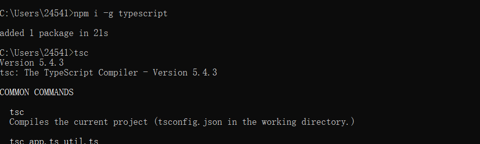
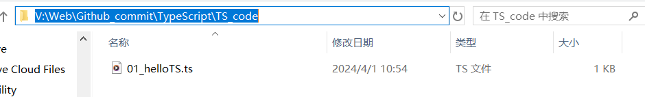
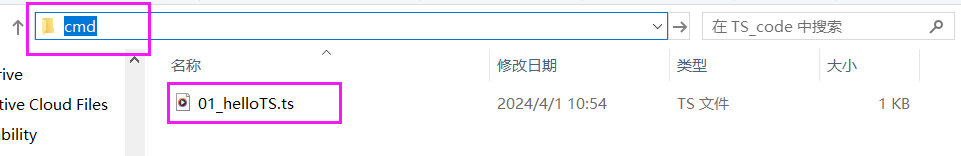
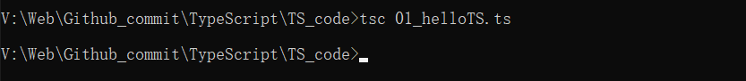
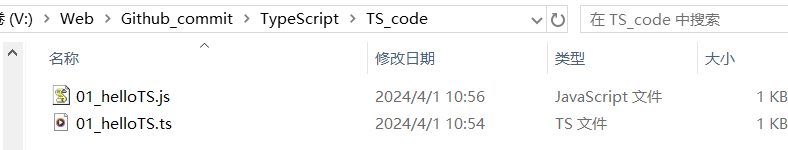
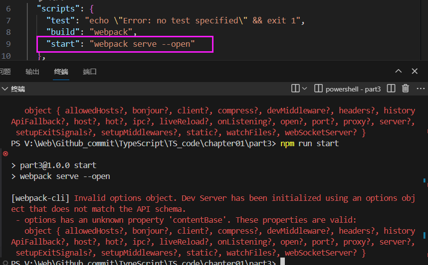
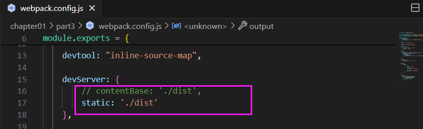
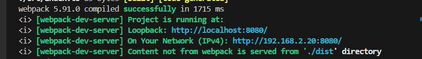

# TypeScript 

> BV1Xy4y1v7S2学习笔记

# 00 概念

以 JavaScript 为基础构建的语言

一个 JavaScript 的超集

TypeScript扩展了JavaScript，并添加了类型

可以在任何支持JavaScript的平台中执行


- TS不能被 JS解析器 直接执行。需要先把 TS 编译成 JS


**TS 增加了什么？**

类型、支持ES新特性、添加了ES不具备的新特性、丰富的配置选项（TS可以被编译为任何版本的 JS）、强大的开发工具


# 01 开发环境搭建

1. 下载Node.js（**TS需要编译为 JS，TS解析器是用 node写的**）
   - 64位：https://nodejs.org/dist/v14.15.1/node-v14.15.1-x64.msi
   - 32位：https://nodejs.org/dist/v14.15.1/node-v14.15.1-x86.msi
   - node -v 检测是否安装成功
2. 安装Node.js
3. 使用npm（node里面的包管理器）全局安装typescript
   - 进入命令行cmd
   - 输入：npm i -g typescript
   - tsc 命令，检测是否安装成功
   -  
4. 创建一个ts文件 **（后缀名为 ts）**
5. 使用tsc对ts文件进行编译
   - 进入命令行

   - 进入ts文件所在目录

   - 执行命令：tsc xxx.ts

 **具体步骤：**

 

 

 

多了一个js代码

 

# 02 基本类型

## 基本使用

基本使用：变量的声明+赋值

```typescript
// （1）声明一个变量a，同时执行他的类型为number
let num1:number;
// a 的类型设置为 number，在以后的使用过程中 a 的值只能是数字

num1 = 10;
//  a = 'hello'; // 报错 不能将string类型给a

let num2:number = 20;

// （2）如果变量的【声明和赋值】是同时进行的，TS可以自动对变量进行类型检测
let a = true;
// a = 123 这样是会报错的

```

基本使用：在函数中使用

```typescript
//（3）最好的使用场景是 函数中形参的类型
function sum(a, b) {
    return a+b;
}
console.log(sum(123, 456))
console.log(sum(123, '456')) //这样是不报错的

// 修改为
function sum(a:number, b:number) {
    return a+b;
}

// （4）函数返回值的类型
function sum3(a:number, b:number): number{
  return a + b;
}
```


## ⭐类型

自动类型判断

- TS拥有自动的类型判断机制
- 当对变量的声明和赋值是同时进行的，TS编译器会自动判断变量的类型
- 所以如果你的变量的声明和赋值时同时进行的，可以省略掉类型声明

|  类型   |       例子        |              描述              |
| :-----: | :---------------: | :----------------------------: |
| number  |    1, -33, 2.5    |            任意数字            |
| string  | 'hi', "hi", `hi`  |           任意字符串           |
| boolean |    true、false    |       布尔值true或false        |
| 字面量  |      其本身       |  限制变量的值就是该字面量的值  |
|   any   |         *         |            任意类型            |
| unknown |         *         |         类型安全的any          |
|  void   | 空值（undefined） |     没有值（或undefined）      |
|  never  |      没有值       |          不能是任何值          |
| object  |  {name:'孙悟空'}  |          任意的JS对象          |
|  array  |      [1,2,3]      |           任意JS数组           |
|  tuple  |       [4,5]       | 元素，TS新增类型，固定长度数组 |
|  enum   |    enum{A, B}     |       枚举，TS中新增类型       |


- 字面量

```typescript
let a:10;
a = 10;
// a = 11; // 报错：不能将类型“11”分配给类型“10”。
// 有点像常量

// 常用
// 使用 | 链接多个类型（联合类型）
let b: "male" | "false";
b = "male";
b = "false";

let c:boolean | string;
c = true;
c = "hello";
c = false;
```

- any

```typescript
// any表示的是任意类型
// 一个变量设置类型为 any 后相当于对该变量关闭了 TS 的类型检测
let d:any;

// 声明变量如果不指定类型，则TS解析器会自动判断变量的类型为any（隐式的any）
let d2;
d2 = 10;
d2 = 'hello';
d2 = true;
```

- unknown

```typescript
// unknown 表示未知类型的值
// 类型安全的any
// 不可以直接赋值给其他变量
let e: unknown;
e = 10;
e = 'hello';
e = true;

// 区别any类型的好处为：
let str:string; // string
let _a; // 隐式any
str = _a // 这样是不会报错的

// 但是如果使用unknown 就会报错
e = 'hello'
// str = e // 报错：不能将类型“unknown”分配给类型“string”。

// 不可以直接赋值给其他变量
// 解决方法一 
if(typeof e === 'string') {
  str = e
}

// 解决方法二 类型断言
str = e as string; // 告诉解析器e的实际类型

// 解决方法三 
str = <string>e
```

- void & never

```typescript
// void用来表示空
// 以函数为例，就表示没有返回值的函数
function fn(): void {

}

// never表示永远不会返回结果
function fn2(): never {
  throw new Error('报错了！')
}
// 函数不会返回结果，报错之后直接停止
```

- object

```typescript
let a :object; // 表示一个JS对象
a = {};
a = function() {};

// {}用来指定对象中可以包含哪些属性
// 语法:{属性名:属性值，属性名:属性值}
let b :{name: string}; 
b = {name:'haha'}

// 加问号？表示属性可选
let b2 :{name: string, age?:number}; 
b2 = {name:'孙悟空'}
b2 = {name:'孙悟空',age: 18}

// [propName : string] : any表示任意类型的属性
// propName:string表示 【属性名：字符串】，JS中的属性名都是字符串
// propName 自己起名
// [propName:string] 表示任意字符串属性名
// any 任意类型
let c: {name:string,[propName:string]:any};
c = {name:'猪八戒',age:18, gender:'男'}

/**
 * 设置函数结构的类型声明
 *   语法：（形参：类型，形参：类型...） => 返回值
 */
// 声明函数
// 函数有两个参数，都是 number 类型
// 返回值也是number类型
let d:(a:number, b:number) => number;
d = function(n1,n2) :number{
  return n1+n2
}
```

- array

```typescript
/**
 * 数组的类型声明
 *           类型[]
 *           Array<类型>
 */
// string表示字符串数组
let e: string[]; 
let g: Array<number>;

e = ['a','b','c']
g = [1, 2, 3]
```


- 元组

```typescript
// 元组，元组就是固定长度的数组
/**
 * 
 * 语法 [类型，类型， ...]
 */
let h : [string, string]
h = ['hello', 'abc']

let h2 : [string, number]
h2 = ['hello', 234]

let h3 : [string, number, string]
h3 = ['hello', 234, 'world']
```

- enum枚举

```typescript
let i: {name: string, gender: string};
i = {
  name: '孙悟空',
  gender: '男'
}
console.log(i.gender === '男');


// 因为性别只有两种,所以可以使用 枚举类
enum Gender {
  Male,
  Female
}

let i2: {name: string, gender: Gender};
i2 = {
  name: '孙悟空',
  gender: Gender.Male
}

console.log(i2.gender === Gender.Female);
console.log(i2.gender === Gender.Male);
```

- '或' 和 '与'

```typescript
let j: string | number;
let j2: string & number; // 这种写法本身就是错的，一个变量不可能同时满足两个类型

let obj: {name:string} & {age:number};
obj = {name:'孙悟空', age: 19}
```

- 类型别名

```typescript
let k: 1|2|3|4|5;
let l: 1|2|3|4|5;

type myType = string
let m: myType

type myType2 = 1|2|3|4|5;
let k2: myType2;
let l2: myType2;
```


# 03 编译选项

1、自动编译文件

编译文件时，使用 -w 指令后，TS编译器会自动监视文件的变化，并在文件发生变化时对文件进行重新编译。

示例 ```tsc xxx.ts -w```

2、自动编译整个项目

直接使用tsc指令 ```tsc -w```，则可以自动将当前项目下的所有ts文件编译为js文件。但是能直接使用tsc命令的前提时，要先在项目根目录下创建一个ts的配置文件 **tsconfig.json**


##  tsconfig.json

tsconfig.json是一个JSON文件，添加配置文件后，只需 tsc -w 即可完成对整个项目的编译

tsconfig.json是 ts编译器的配置文件，ts编译器可以根据它的信息来对代码进行编译

<font color="red"> **配置选项**</font>

**① include** 

定义希望被编译文件所在的目录

默认值：["\*\*/\*"]

- 示例：

```
"include":["src/**/*", "tests/**/*"]
上述示例中，所有src目录和tests目录下的文件都会被编译
```

**② exclude**

定义需要排除在外的目录

默认值：["node_modules", "bower_components", "jspm_packages"]

- 示例：

```
"exclude": ["./src/hello/**/*"]

上述示例中，src下hello目录下的文件都不会被编译
```

**③ extends**

定义被继承的配置文件

- 示例：

```
"extends": "./configs/base"
上述示例中，当前配置文件中会自动包含config目录下base.json中的所有配置信息
```

**④ files**

指定被编译文件的列表，只有需要编译的文件少时才会用到

- 示例：

```
列表中的文件都会被TS编译器所编译：
"files": [
    "core.ts",
    "sys.ts",
    "types.ts",
    "scanner.ts",
    "parser.ts",
    "utilities.ts",
    "binder.ts",
    "checker.ts",
    "tsc.ts"
  ]
```

### compilerOptions

编译选项是配置文件中非常重要也比较复杂的配置选项

在compilerOptions中包含多个子选项，用来完成对编译的配置

**项目选项：**

- <font color="blue">**target**</font>

  - 设置ts代码编译的目标版本

  - 可选值：

    - <font color="blue">如果不知道可选值有哪些，可以在代码里写"target": "ABC"，然后报出来的提示会有具体的可选值</font>ES3（默认）、ES5、ES6/ES2015、ES7/ES2016、ES2017、ES2018、ES2019、ES2020、ESNext

  - 示例：

    ```json
    "compilerOptions": {
        "target": "ES6"
    }
    // 'es3', 'es5', 'es6', 'es2015', 'es2016', 'es2017', 'es2018', 'es2019', 'es2020', 'esnext'
    ```
    
    - 如上设置，我们所编写的ts代码将会被编译为ES6版本的js代码

- <font color="blue">**lib:  library**</font>

  - 指定代码运行时所包含的库（宿主环境）。   用来指定项目中要使用的库

  - 可选值：

    - 'es5', 'es6'等

  - 示例：

    ```json
    "compilerOptions": {
        "lib": ["ES6", "DOM"],
    }
    ```
  
- <font color="blue">**module**</font>

  - 设置编译后代码使用的模块化系统。指定要使用的模块化的规范

  - 可选值：

    - CommonJS、UMD、AMD、System、ES2020、ESNext、None

  - 示例：

    ```typescript
    "compilerOptions": {
        "module": "CommonJS"
    }
    // module 指定要使用的模块化的规范
    // 'none', 'commonjs', 'amd', 'system', 'umd', 'es6', 'es2015', 'es2020', 'esnext'
    ```

- <font color="blue">**outDir**</font>

  - 用来指定编译后文件的所在目录

  - 默认情况下，编译后的js文件会和ts文件位于相同的目录，设置outDir后可以改变编译后文件的位置

  - 示例：

    ```json
    "compilerOptions": {
        "outDir": "dist"
    }
    ```

    - 设置后编译后的js文件将会生成到dist目录

- <font color="blue">**outFile**</font>

  - 将**所有的文**件编译为一个js文件

  - 默认会将所有的编写在全局作用域中的代码合并为一个js文件。如果使用了模块化的话就合并不上了

  - 示例：

    ```json
    "compilerOptions": {
        "outFile": "dist/app.js"
    }
    ```

- <font color="blue">**rootDir**</font>

  - 指定代码的根目录，默认情况下编译后文件的目录结构会以最长的公共目录为根目录，通过rootDir可以手动指定根目录

  - 示例：

    ```json
    "compilerOptions": {
        "rootDir": "./src"
    }
    ```

- <font color="blue">**allowJs**</font>

  - 是否对js文件进行编译，默认是false

- <font color="blue">**checkJs**</font>

  - 是否对js文件进行检查，默认是false

  - 示例：

    ```json
    "compilerOptions": {
        "allowJs": true,
        "checkJs": true
    }
    ```

- <font color="blue">**removeComments**</font>

  - 是否删除注释
  - 默认值：false

- <font color="blue">**noEmit**</font>

  - 不对代码进行编译，不生成编译后的文件
  - 默认值：false。设置为true以后就不生成产生的 js 文件，做检查用

- <font color="blue">**sourceMap**</font>

  - 是否生成sourceMap
  - 默认值：false


### 语法检查相关

**<font color="red">严格检查</font>**

- **strict**
  
  启用**所有的**严格检查，默认值为true，设置后相当于开启了所有的严格检查
  
- alwaysStrict
  
  - 总是以严格模式对代码进行编译，默认false。设置为true后进入严格模式
  
  - 在JS中严格模式是开头写"use strict"，但是TS中语法不是这样，是设置alwaysStrict。总是以严格模式对代码进行编译，默认false。设置为true后进入严格模式。
  
  - 当有模块化的代码时，编译后的JS代码就没有"use strict"了，因为JS会自动进入严格模式
  
- noImplicitAny
  - ```"noImplicitAny": true```  禁止隐式的any类型
  
- noImplicitThis
  - 禁止类型不明确的this
  
- strictBindCallApply
  - 严格检查bind、call和apply的参数列表
  
- strictFunctionTypes
  - 严格检查函数的类型
  
- strictNullChecks
  - 严格的空值检查
  
- strictPropertyInitialization
  - 严格检查属性是否初始化

- 额外检查

  - noFallthroughCasesInSwitch
    - 检查switch语句包含正确的break
  - noImplicitReturns
    - 检查函数没有隐式的返回值
  - noUnusedLocals
    - 检查未使用的局部变量
  - noUnusedParameters
    - 检查未使用的参数
- 高级

  - allowUnreachableCode
    - 检查不可达代码
    - 可选值：
      - true，忽略不可达代码
      - false，不可达代码将引起错误
  - **noEmitOnError**
    - 有错误的情况下不进行编译
    - 默认值：false

# 04 webpack打包ts代码

通常情况下，实际开发中我们都需要使用构建工具对代码进行打包，TS同样也可以结合构建工具一起使用，下边以webpack为例介绍一下如何结合构建工具使用TS。


步骤：

1. 初始化项目

   进入项目根目录，执行命令 ``` npm init -y```

   主要作用：创建package.json文件（管理项目，项目里的依赖、命令）

2. 下载构建工具

   命令：```npm i -D webpack webpack-cli webpack-dev-server typescript ts-loader clean-webpack-plugin html-webpack-plugin``` 。（这里也可以用cnpm是国内的镜像。-D是开发依赖全称是DEV；webpack是打包工具的核心代码；webpack-cli是命令行工具，安装之后可以用命令行使用打包工具；typescript ts的核心包；）

   **共安装了7个包：**

   - webpack：构建工具webpack
   - webpack-cli：webpack的命令行工具
   - webpack-dev-server：webpack的开发服务器，可以在这个服务器中运行
   - typescript：ts编译器
   - ts-loader：ts加载器，用于在webpack中编译ts文件
   - html-webpack-plugin：webpack中html插件，用来自动创建html文件
   - clean-webpack-plugin：webpack中的清除插件，每次构建都会先清除目录

3. 根目录下创建webpack的配置文件webpack.config.js（webpack的配置信息）

   ```javascript
   // node.js中的一个模块，作用是拼接路径
   const path = require("path"); 
   
   // npm i -D html-webpack-plugin
   // 引入插件
   const HtmlWebpackPlugin = require("html-webpack-plugin");
   
   // webpack.config.js
   //引入clean插件
   const { CleanWebpackPlugin } = require("clean-webpack-plugin");
   
   //webpack中所有的配置信息都应该写在module.exports中
   module.exports = {
       optimization:{
           minimize: false // 关闭代码压缩，可选
       },
   
       // 入口文件
       entry: "./src/index.ts", 
       
       devtool: "inline-source-map",
       
       
       devServer: {
           contentBase: './dist'
       },
   
       // 打包文件所在的目录
       output: {
           // 指定打包文件的目录
           path: path.resolve(__dirname, "dist"),
           // 打包后文件的名字
           filename: "bundle.js",
           environment: {
               arrowFunction: false // 关闭webpack的箭头函数，可选
           }
       },
   
       // 用来设置引用模块
       resolve: {
           extensions: [".ts", ".js"]
       },
       
       // 指定webpack打包时要使用的模块
       module: {
           // 指定加载的规则
           rules: [
               {
                   // test指定规则生效的文件
                   test: /\.ts$/,
                   // 用ts-loader去处理以ts结尾的文件
                   use: {
                      loader: "ts-loader"     
                   },
                   // 要排除的文件
                   exclude: /node_modules/
               }
           ]
       },
   
       // 配置webpack插件
       plugins: [
           new CleanWebpackPlugin(),
     
           new HtmlWebpackPlugin({
               title:'TS测试',
               template: './src/index.html'// 根据我的代码中的模板生成HTML
           }),
       ]
   
   }
   ```

4. 根目录下创建 tsconfig.json，配置可以根据自己需要

   ```json
   {
       "compilerOptions": {
           "target": "ES2015", // ES2015就是ES6
           "module": "ES2015",
           "strict": true
       }
   }
   ```

5. 修改package.json添加如下配置

   ```json
   {
     ...略...
     "scripts": {
       "test": "echo \"Error: no test specified\" && exit 1",
       "build": "webpack",// 添加这一句话
       "start": "webpack serve --open chrome.exe" 
       // webpack-dev-server
       // 添加这一句话
     },
     ...略...
   }
   ```

6. 在src下创建ts文件，并在并命令行执行```npm run build```对代码进行编译，或者执行```npm start```来启动开发服务器


## 错误解决

- **package.json 中设置了  "start": "webpack serve --open" 之后，npm run start 报如下错误**

>Invalid options object. Dev Server has been initialized using an options object that does not match the API schema.options has an unknown property 'contentBase'. These properties are valid: object { allowedHosts?, bonjour?, client?, compress?, devMiddleware?, headers?, historyApiFallback?, host?, hot?, ipc?, liveReload?, onListening?, open?, port?, proxy?, server?, setupExitSignals?, setupMiddlewares?, static?, watchFiles?, webSocketServer? }
 


解决方法：在webpack.config.js中 把contentBase注释掉，修改成static 

 

static的意思是，将dist目录下的文件作为额外可访问文件

>  参考文裆：https://blog.csdn.net/u013803303/article/details/124733344


- **npm run start（"start": "webpack serve --open" ）之后 没有生成bundle.js文件了，但是会弹出网页**

dist目录下并没有生成bundle.js文件，这是因为webpack-dev-server将打包好的文件放在了内存中，并没有存放到实际的物理磁盘上，我们可以认为webpack-dev-server把打包好的文件，以一种虚拟的形式，托管到了项目的根目录中，虽然看不到它，但是可以认为和dits、src、node_modules平级，叫做bundle.js。

> 原文链接：https://blog.csdn.net/qq_37230495/article/details/114893495

 

可以直接点击链接访问

# 05 babel

经过一系列的配置，使得TS和webpack已经结合到了一起，除了webpack，开发中还经常需要结合babel来对代码进行转换以使其可以兼容到更多的浏览器，在上述步骤的基础上，通过以下步骤再将babel引入到项目中。

1. 安装依赖包：

   ```npm i -D @babel/core @babel/preset-env babel-loader core-js```

   共安装了4个包，分别是：

   - @babel/core：babel的核心工具
   - @babel/preset-env：babel的预定义环境
   - @babel-loader：babel在webpack中的加载器
   - core-js：core-js用来使老版本的浏览器支持新版ES语法

2. 修改**webpack.config.js**配置文件

   引入的是一个加载器，加载器从后往前执行，所以babel-loader要在ts-loader前

   ```javascript
   ...略...
   module: {
       rules: [
           {
               test: /\.ts$/,
               use: [
                   {   
                       //指定要用的加载器
                       loader: "babel-loader",
                       options:{
                           //设置与定义环境
                           presets: [
                               [
                                   // 指定环境的插件
                                   "@babel/preset-env",
                                   // 配置信息
                                   {
                                       // 浏览器版本
                                       "targets":{
                                           "chrome": "58", 
                                           "ie": "11"
                                       },
                                       // 指定corejs的版本
                                       "corejs":"3",
                                       // 使用codejs的方法
                                       "useBuiltIns": "usage"
                                       // usage是按需加载
                                   }
                               ]
                           ]
                       }
                   },
                   {   
                       loader: "ts-loader",
   
                   }
               ],
               exclude: /node_modules/
           }
       ]
   }
   ...略...
   ```

   - 如此一来，使用ts编译后的文件将会再次被babel处理，使得代码可以在大部分浏览器中直接使用，可以在配置选项的targets中指定要兼容的浏览器版本。

